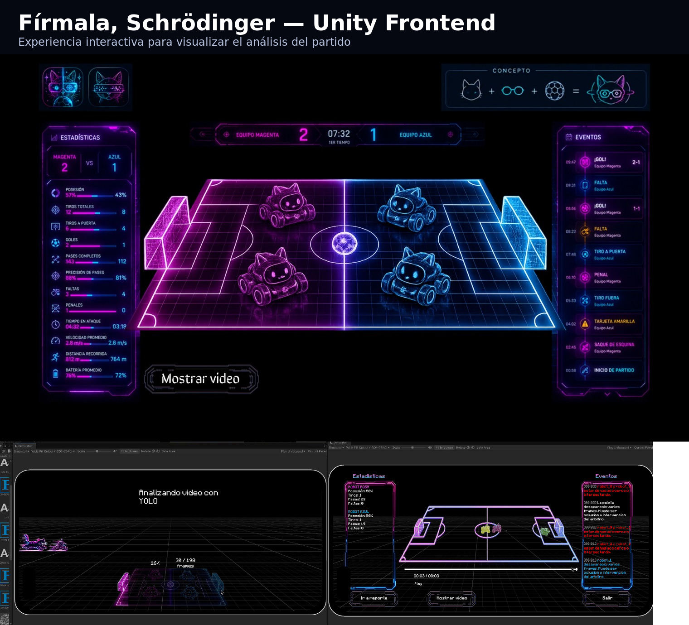
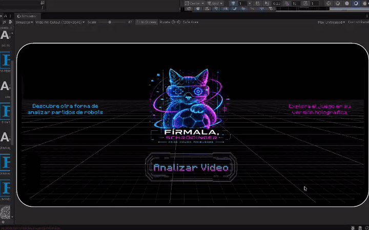
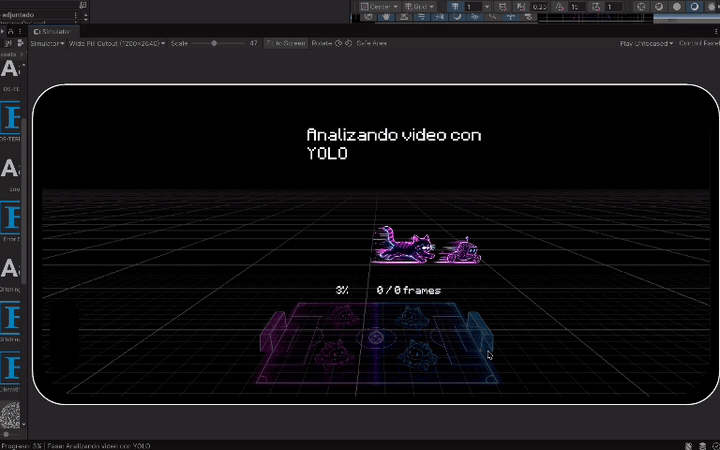
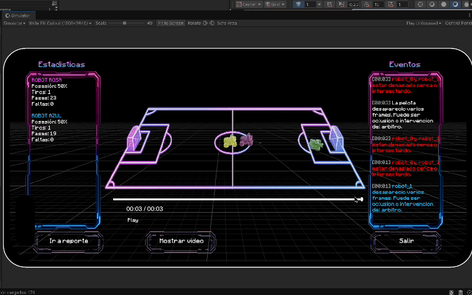
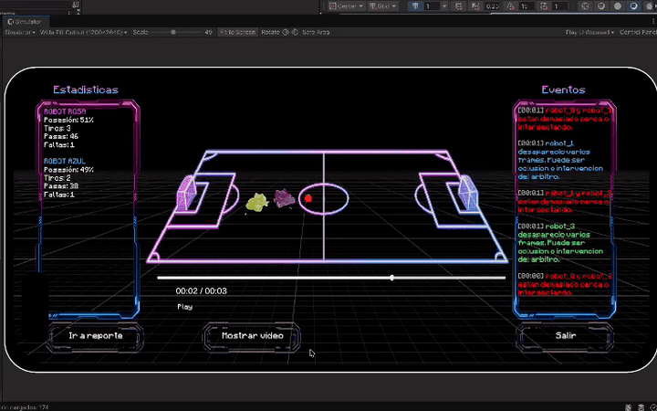
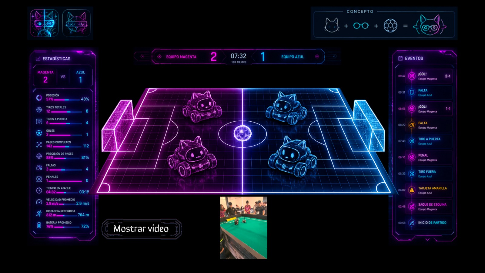

<h1 align="center">Fírmala, Schrödinger — FutBotMX Unity Experience</h1>

<p align="center">
  Plataforma interactiva para procesar y visualizar partidos de fútbol robótico mediante un backend de visión por computadora y un frontend desarrollado en Unity.
</p>

<p align="center">
  <strong>Backend v11.5.2</strong> · <strong>Frontend Unity — prototipo funcional</strong>
</p>

<p align="center">
  
  
  
  
  
</p>

<p align="center">
  
</p>

---

## Estado actual

Esta versión conserva el backend de **Fírmala, Schrödinger — FutBotMX Vision Analytics**, pero utiliza una interfaz desarrollada en **Unity** para presentar el análisis de forma interactiva.

El frontend permite seleccionar un video, observar el progreso del procesamiento y explorar los resultados sobre una cancha digital. La interfaz reúne estadísticas, eventos, reproducción temporal, video de referencia y acceso al reporte generado por el backend.

> Este README es provisional. La versión exacta de Unity, los nombres de escenas, las rutas internas y los pasos de compilación deberán confirmarse cuando se integre el proyecto fuente completo.

---

## Enlaces

- **Video oficial de demostración:** [Ver demo](REEMPLAZAR_CON_ENLACE_DEMO)
- **Reel público de Instagram:** [Ver Reel](REEMPLAZAR_CON_ENLACE_REEL)
- **Diseño conceptual:** [`docs/images/unity_concept.png`](docs/images/unity_concept.png)
- **Vista del replay:** [`docs/images/unity_replay.png`](docs/images/unity_replay.png)
- **Código de ejecutable de unity:** (https://drive.google.com/drive/folders/1IKbM6GA5Y9Oyyt2F17DVHwTxgsR2S8Ac?usp=sharing)

---

# Descripción general

El proyecto se divide en dos capas:

1. **Backend en Python:** detecta robots, pelota, cancha y porterías; mantiene identidades; reconstruye la geometría del campo; calcula métricas y genera eventos.
2. **Frontend en Unity:** organiza y presenta los resultados en una experiencia visual navegable.

Unity actúa como la capa de interacción del sistema. En lugar de revisar por separado archivos JSON, videos y reportes, el usuario puede cargar un partido y consultar sus resultados desde una misma interfaz.

---

# Arquitectura

```mermaid
flowchart LR
    A[Video del partido] --> B[Frontend Unity]
    B --> C[Backend Python]
    C --> D[YOLO: detección rápida]
    D --> E[Tracking temporal]
    E --> F[SAM 3: análisis semántico dirigido]
    F --> G[Holograma y coordenadas métricas]
    G --> H[Eventos y estadísticas]
    H --> I[JSON, video procesado y reporte]
    I --> J[Cancha digital en Unity]
    J --> K[Replay, eventos, estadísticas y video]
```



## Intercambio de datos

El backend genera artefactos que pueden ser consumidos por Unity:

```text
futbot_unity_mesa.json
match_tracks.json
match_events.json
quick_preview.mp4
report/reporte_final.pdf
```

Estos archivos contienen posiciones temporales, identidades, equipos, eventos, marcador, métricas y referencias visuales.

La ruta exacta y el mecanismo de comunicación deben actualizarse cuando se confirme la integración final entre Unity y Python.

---

# Papel de SAM 3

SAM 3 funciona como la **capa semántica de referencia** del backend. Su información se combina con detecciones rápidas de YOLO, tracking temporal y contexto geométrico.

Debido a su costo computacional, SAM 3 se aplica de forma dirigida sobre candidatos y ventanas de mayor valor, especialmente cuando un evento importante requiere evidencia visual adicional. De esta manera, el pipeline aprovecha su capacidad de segmentación y comprensión contextual sin ejecutarlo innecesariamente sobre todos los cuadros.

YOLO mantiene la detección rápida y consistente; SAM 3 aporta contexto cuando una caja de detección no describe por sí sola toda la escena.

---

# Funciones del frontend Unity

## 1. Selección del video

La pantalla inicial permite seleccionar un archivo compatible e iniciar el análisis.

<p align="center">
  
</p>

El prototipo incluye:

- selector de archivo;
- validación de formatos;
- botón para cargar el video;
- opción para salir o reiniciar.

## 2. Progreso del procesamiento

Mientras el backend analiza el partido, Unity muestra una escena de progreso con una representación estilizada de la cancha y los robots.

<p align="center">
  
</p>

La interfaz puede mostrar:

- etapa actual del pipeline;
- porcentaje completado;
- cuadros procesados;
- animación de cancha y robots;
- mensaje de finalización.

## 3. Cancha digital

Los resultados se visualizan sobre una cancha virtual con los colores magenta y azul.

<p align="center">
  
</p>

La escena representa:

- robots;
- pelota;
- porterías;
- posiciones reconstruidas;
- orientación del partido.

## 4. Estadísticas

El panel lateral puede presentar métricas como:

- posesión;
- tiros;
- pases;
- faltas;
- distancia;
- velocidad;
- actividad por equipo.

Las métricas visibles dependen de la información confiable disponible en cada partido.

## 5. Cronología de eventos

El panel de eventos presenta registros ordenados por tiempo, por ejemplo:

- cambios de posesión;
- pelota perdida o recuperada;
- robot inactivo o reactivado;
- posibles colisiones;
- goles;
- eventos arbitrales compatibles con la evidencia disponible.

## 6. Replay interactivo

El usuario puede recorrer el partido sobre la cancha digital y comparar la reconstrucción con el video de referencia.

<p align="center">
  
</p>

Controles visibles en el prototipo:

- reproducir o pausar;
- barra temporal;
- mostrar u ocultar el video;
- abrir el reporte;
- salir de la visualización.

## 7. Video de referencia

Unity puede mostrar el video del partido dentro de la misma interfaz para comparar la escena real con la reconstrucción digital.

<p align="center">
  
</p>

---

# Backend de visión por computadora

El backend conserva las funciones principales del proyecto original:

- detección de robots, pelota, cancha y porterías;
- tracking de hasta cuatro robots y una pelota;
- protección ante cruces y oclusiones;
- reconstrucción offline de identidades;
- clasificación de equipos;
- recuperación visual de la pelota;
- calibración mediante holograma y keyframes;
- proyección sobre una cancha de **243 × 182 cm**;
- distancia, velocidad, posesión y control territorial;
- detección de eventos;
- exportación de datos para Unity;
- reporte HTML/PDF multipágina.

El sistema distingue entre mediciones, recuperaciones visuales, predicciones e interpolaciones. Cuando la evidencia no es suficiente, puede conservar un estado desconocido o reportar `N/D`.

---

# Flujo de uso

```text
1. Abrir la aplicación Unity.
2. Seleccionar un video compatible.
3. Iniciar el análisis.
4. Esperar a que termine el backend.
5. Abrir la visualización del partido.
6. Revisar estadísticas y eventos.
7. Reproducir la reconstrucción temporal.
8. Mostrar el video de referencia cuando sea necesario.
9. Abrir el reporte final.
```

---

# Ejecución del backend

## Procesamiento completo

```bash
python -m src.main_supr "inputs/partido.mov" \
  --sam-mode LoHa \
  --field-calibration hologram \
  --performance-profile quality \
  --pdf
```

## Prueba ligera

```bash
python -m src.main_supr "inputs/video-1096_singular_display.mov" \
  --sam-mode none \
  --performance-profile cpu \
  --yolo-imgsz 416 \
  --field-calibration hologram \
  --no-field-debug \
  --no-tracking-debug \
  --replay-frame-stride 3 \
  --pdf
```

El modo `none` permite pruebas sin cargar SAM 3, pero no representa el flujo semántico completo.

---

# Instalación del backend

```bash
git clone REEMPLAZAR_CON_URL_DEL_REPOSITORIO
cd REEMPLAZAR_CON_NOMBRE_DEL_REPOSITORIO
python -m venv .venv
```

### Windows

```powershell
.venv\Scripts\activate
```

### Linux o macOS

```bash
source .venv/bin/activate
```

Después:

```bash
python -m pip install --upgrade pip setuptools wheel
python -m pip install -r requirements.txt
python -m playwright install chromium
```

FFmpeg también debe estar disponible desde la terminal.

---

# Instalación del frontend Unity

> Completar esta sección cuando se integre el proyecto fuente.

Datos pendientes:

- versión exacta de Unity;
- escena inicial;
- render pipeline;
- paquetes requeridos;
- ruta del ejecutable de Python;
- carpeta de intercambio de resultados;
- pasos de compilación.

Estructura esperada:

```text
UnityFrontend/
├── Assets/
├── Packages/
└── ProjectSettings/
```

Pasos provisionales:

```text
1. Abrir Unity Hub.
2. Agregar UnityFrontend como proyecto existente.
3. Abrirlo con la versión documentada.
4. Configurar la ruta del backend o de outputs.
5. Ejecutar la escena principal.
```

---

# Estructura recomendada

```text
.
├── README.md
├── LICENSE
├── requirements.txt
├── Backend/
│   ├── src/
│   ├── config/
│   ├── tools/
│   ├── tests/
│   ├── inputs/
│   └── outputs/
├── UnityFrontend/
│   ├── Assets/
│   ├── Packages/
│   └── ProjectSettings/
└── docs/
    └── images/
        ├── unity_overview.png
        ├── unity_concept.png
        ├── unity_home.png
        ├── unity_processing.png
        ├── unity_dashboard.png
        ├── unity_replay.png
        ├── unity_video_overlay.png
        ├── load_video.gif
        ├── processing.gif
        └── replay_interface.gif
```

---

# Salidas principales

```text
outputs/nombre_del_partido/
├── quick_preview.mp4
├── quick_detections.jsonl
├── tracking_debug.jsonl
├── field_hologram_calibration.json
├── field_homography.jsonl
├── match_tracks.json
├── match_events.json
├── futbot_unity_mesa.json
├── mesa_replay_events.mp4
└── report/
    ├── reporte_final.html
    ├── reporte_final.pdf
    └── report_data.json
```

---

# Limitaciones actuales

- La versión final de Unity y sus dependencias todavía deben documentarse.
- La comunicación exacta entre Unity y Python debe verificarse en una instalación limpia.
- La precisión de la cancha digital depende de la calibración.
- Las oclusiones prolongadas pueden afectar la continuidad de las identidades.
- SAM 3 es la etapa más costosa y se ejecuta de manera selectiva.
- Las posibles colisiones se presentan como candidatos para revisión.
- La interfaz puede requerir ajustes para diferentes resoluciones.
- Los textos y métricas de las capturas pertenecen a un prototipo y pueden cambiar.

---

# Créditos

Proyecto desarrollado por **Lore, Yamis y Oscar** para la Copa FutBotMX, capítulo Visión por Computadora.

Tecnologías principales:

- Unity;
- Python;
- SAM 3, Meta AI;
- PyTorch;
- Hugging Face Transformers y PEFT;
- Ultralytics YOLO;
- OpenCV;
- NumPy y SciPy;
- Jinja2;
- Playwright;
- FFmpeg.

Los videos utilizados fueron proporcionados dentro del contexto de la Copa FutBotMX y la Federación Mexicana de Robótica.

---

# Licencia

El código desarrollado por el equipo se distribuye bajo la licencia MIT, salvo componentes de terceros, modelos, pesos y datos sujetos a licencias diferentes.

Consulte [`LICENSE`](LICENSE).

---

<p align="center">
  <strong>Fírmala, Schrödinger — Python Vision Backend + Unity Interactive Frontend</strong>
</p>
