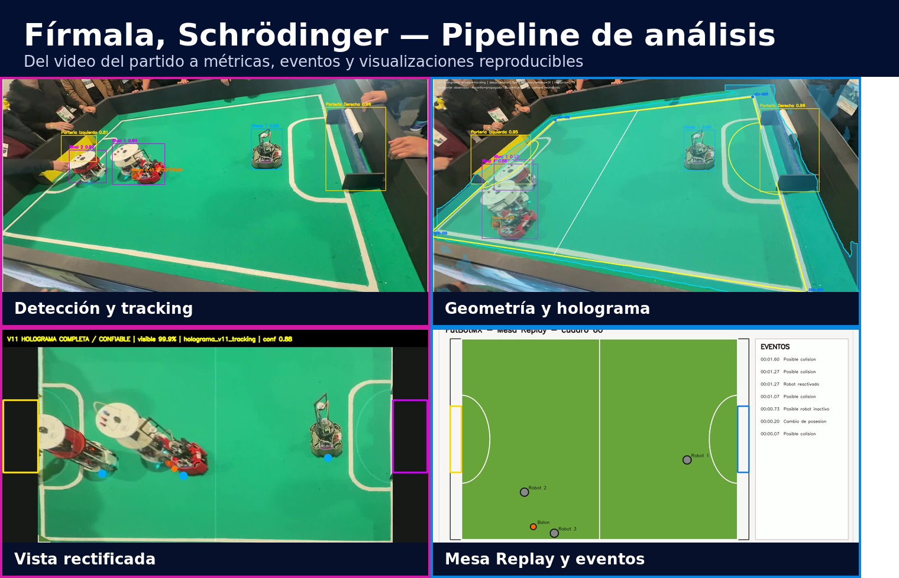
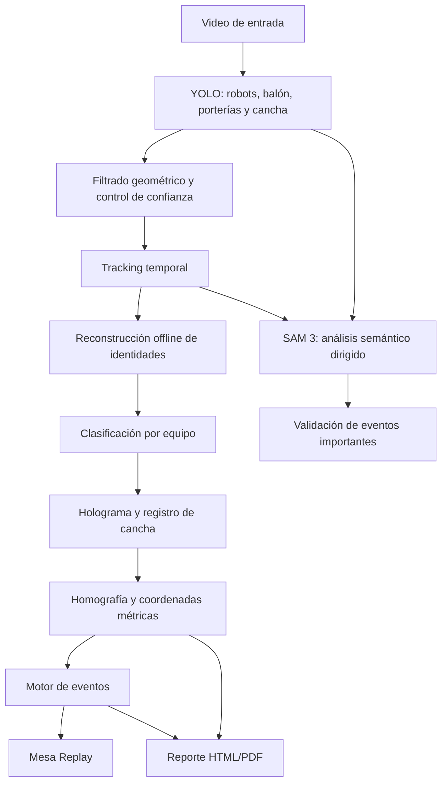
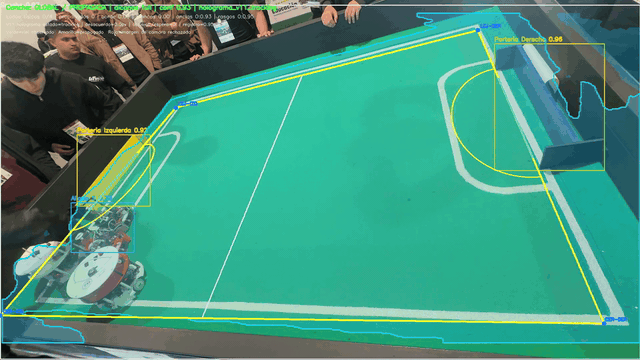
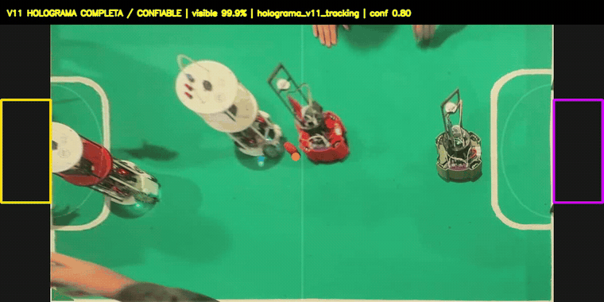
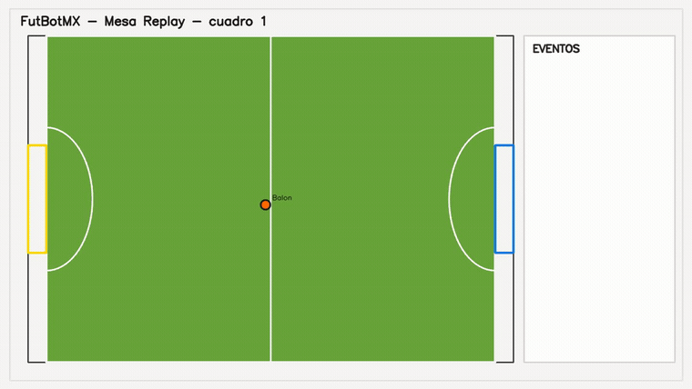
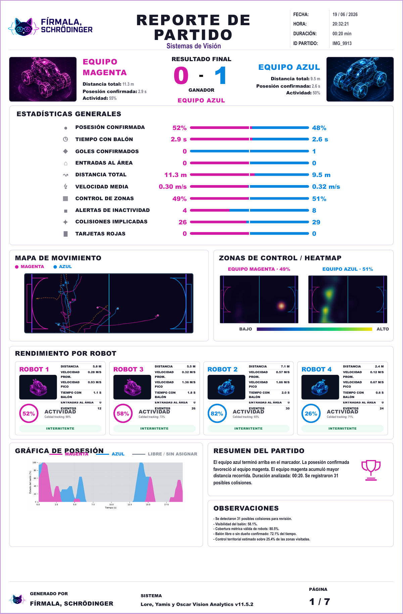

<h1 align="center">Fírmala, Schrödinger — FutBotMX Vision Analytics</h1>

<p align="center">
  Pipeline híbrido de visión por computadora para segmentar, rastrear y analizar partidos de fútbol robótico.
</p>

<p align="center">
  <strong>Versión 11.5.2</strong> · <strong>Lore, Yamis y Oscar</strong>
</p>

<p align="center">
  
  
  
  
  
</p>

<p align="center">
  
</p>

---

## Enlaces principales

> Antes de entregar, reemplacen únicamente los dos enlaces marcados.

- **Video oficial de demostración, máximo 2 minutos:** [Ver video]((https://drive.google.com/file/d/1VRmai3D3yio9jtnJlJfg9aP5-IbjQOgY/view?usp=sharing))
- **Reel público de Instagram, mínimo 30 segundos:** [Ver Reel](REEMPLAZAR_CON_ENLACE_REEL)
- **Video procesado de ejemplo:** [Abrir MP4](docs/video_procesado.mp4)
- **Mesa Replay de ejemplo:** [Abrir MP4](docs/mesa_replay.mp4)
- **Reporte PDF:** [Abrir reporte](docs/reporte_final.pdf)

---

# Descripción general

**Fírmala, Schrödinger — FutBotMX Vision Analytics** transforma un video de fútbol robótico en una representación estructurada del partido.

El sistema detecta robots, pelota, porterías y superficie de juego; mantiene identidades temporales; clasifica equipos; proyecta posiciones sobre una cancha métrica; detecta eventos; construye una repetición esquemática; y genera un reporte estadístico HTML/PDF.

El pipeline conserva la procedencia y la confianza de los datos. Una detección medida, una recuperación visual, una predicción y una interpolación no se consideran equivalentes. Cuando la evidencia no es suficiente, el sistema puede abstenerse, conservar un estado desconocido o reportar `N/D`.

---

# Papel de SAM 3

SAM 3 funciona como la **capa semántica de referencia** del pipeline. Su información se combina con propuestas rápidas de YOLO, tracking temporal y contexto geométrico para analizar el partido.

Debido a su costo computacional, SAM 3 no se ejecuta indiscriminadamente sobre todos los cuadros. El sistema lo aplica de manera dirigida sobre ventanas y candidatos de mayor valor, donde su capacidad de segmentación y comprensión contextual aporta más información. Entre estos casos se encuentran la revisión de intervenciones del árbitro y el apoyo a eventos relevantes que requieren evidencia semántica adicional.

Esta estrategia mantiene a SAM 3 dentro del flujo principal de análisis, pero evita que su costo vuelva impráctico el procesamiento completo del video. Según la configuración, se pueden utilizar adaptadores LoHa o DoRa mediante PEFT.

YOLO se utiliza para generar detecciones rápidas y consistentes; SAM 3 aporta contexto semántico en los puntos donde la detección por cajas no es suficiente por sí sola.

---

# Arquitectura



---

# Flujo de procesamiento

## 1. Ingesta y detección

El video se procesa cuadro por cuadro. YOLO genera candidatos para:

- robots;
- pelota;
- porterías;
- superficie de juego;
- elementos auxiliares necesarios para el análisis.

Se utilizan umbrales por clase, filtros de tamaño, posición y relación con la cancha. Las detecciones rechazadas pueden conservarse en archivos de depuración.

## 2. Tracking de robots

El tracker combina:

- distancia espacial;
- predicción de movimiento;
- intersección sobre unión;
- tamaño;
- apariencia;
- confianza;
- soporte sobre la superficie.

Se incluyen protecciones para cruces, oclusiones e intercambios de identidad. Después del tracking online, una etapa offline agrupa tracklets y reconstruye identidades físicas más estables.

## 3. Tracking de la pelota

La pelota se sigue combinando:

- detección YOLO;
- recuperación local por apariencia y color;
- continuidad temporal;
- predicción conservadora;
- interpolación de huecos cortos;
- suavizado offline.

Cada punto conserva información sobre si fue medido, recuperado, predicho o interpolado.

## 4. Clasificación de equipos

Las identidades físicas se agrupan por apariencia y se asignan a los equipos magenta y azul. El sistema conserva el estado desconocido cuando la evidencia visual no permite una decisión segura.

## 5. SAM 3 y análisis semántico

SAM 3 se activa sobre candidatos y ventanas relevantes para aportar segmentación y contexto en situaciones donde una caja de detección no representa toda la evidencia visual.

Esta capa se utiliza especialmente para apoyar la interpretación de eventos importantes y revisar casos relacionados con intervención arbitral o retiro de robots.

## 6. Holograma y geometría

El usuario alinea una plantilla métrica de la cancha sobre el video. La calibración puede corregirse mediante keyframes cuando cambia la cámara o existe una oclusión importante.

La cancha utilizada por el sistema mide:

```text
243 cm × 182 cm
```

La transformación permite obtener:

- posición métrica de robots y pelota;
- distancia recorrida;
- velocidad;
- control territorial;
- zonas de actividad;
- ubicación respecto a porterías y áreas.

Una coordenada solo se usa en eventos oficiales cuando la transformación geométrica es válida y está respaldada por superficie visible.

## 7. Eventos

El motor puede generar:

- cambio de posesión;
- balón oculto;
- balón recuperado;
- balón fuera;
- robot inactivo;
- robot reactivado;
- posibles colisiones;
- entrada al área;
- gol;
- tarjeta roja cuando existe evidencia de retiro;
- fin del partido.

Los eventos contienen timestamp, participantes, equipo, confianza y marcador acumulado cuando aplica.

Los posibles choques se presentan como candidatos para revisión y no como una afirmación física absoluta.

## 8. Visualización y reporte

El sistema produce:

- video con detecciones y tracking;
- video de geometría y holograma;
- vista rectificada;
- Mesa Replay;
- mapa de movimiento;
- heatmaps por equipo;
- gráfica temporal de posesión;
- estadísticas generales y por robot;
- cronología multipágina de eventos;
- reporte HTML/PDF.

---

# Resultados visuales

## Detección, identidad y tracking

<p align="center">
  
</p>

El video muestra detecciones de robots, pelota y porterías, además de las identidades y colores de equipo reconstruidos por el pipeline.

## Registro geométrico y holograma

<p align="center">
  
</p>

La plantilla métrica se alinea con las líneas y límites visibles de la cancha. La geometría se propaga temporalmente y puede reanclarse mediante keyframes.

## Vista rectificada

<p align="center">
  
</p>

La vista rectificada permite observar el partido desde un sistema de coordenadas consistente y verificar la transformación utilizada para las métricas.

## Mesa Replay

<p align="center">
  
</p>

Mesa Replay proyecta robots, pelota y eventos sobre una cancha esquemática de dimensiones físicas.

## Reporte final

<p align="center">
  
</p>

El reporte completo del ejemplo contiene una página de resumen y páginas adicionales para la cronología de eventos.

---

# Resultado del ejemplo incluido

Los archivos de `docs/` corresponden a un clip de aproximadamente **19.84 segundos**. En esta ejecución se obtuvo:

| Métrica | Magenta | Azul |
|---|---:|---:|
| Marcador | 0 | 1 |
| Posesión confirmada | 52 % | 48 % |
| Tiempo con balón | 2.9 s | 2.6 s |
| Distancia total | 11.3 m | 9.5 m |
| Velocidad media | 0.30 m/s | 0.32 m/s |
| Control de zonas | 49 % | 51 % |

Información adicional del ejemplo:

- visibilidad de la pelota: **58.1 %**;
- cobertura métrica válida de robots: **80.5 %**;
- 64 registros de eventos distribuidos en 7 páginas;
- 31 posibles colisiones marcadas para revisión.

Estos valores documentan una ejecución específica y no deben interpretarse como un benchmark general del sistema.

---

# Estructura del proyecto

```text
.
├── README.md
├── LICENSE
├── requirements.txt
├── config/
├── inputs/
├── outputs/
├── tools/
│   └── rebuild_postprocessing.py
├── tests/
├── docs/
│   ├── images/
│   │   ├── pipeline_overview.png
│   │   ├── tracking.gif
│   │   ├── hologram.gif
│   │   ├── rectified.gif
│   │   ├── replay.gif
│   │   ├── report_dashboard.png
│   │   └── event_timeline.png
│   ├── video_procesado.mp4
│   ├── mesa_replay.mp4
│   ├── reporte_final.pdf
│   └── reporte_final.html
└── src/
    ├── C_quick_view/
    ├── D_domain/
    ├── E_events/
    ├── F_simulation/
    ├── H_report/
    ├── I_field_geometry/
    ├── shared/
    └── main_supr.py
```

La estructura interna puede cambiar ligeramente entre revisiones. El punto de entrada principal es `src.main_supr`.

---

# Instalación

## Requisitos

- Python 3.11 o superior.
- Git.
- FFmpeg.
- Chromium de Playwright para generar el PDF.
- GPU NVIDIA con CUDA recomendada.
- Apple Silicon compatible mediante MPS.
- CPU compatible, con mayor tiempo de procesamiento.

## Crear entorno

### Windows

```powershell
py -3.11 -m venv .venv
.venv\Scripts\activate
```

### Linux o macOS

```bash
python3.11 -m venv .venv
source .venv/bin/activate
```

## Instalar dependencias

```bash
python -m pip install --upgrade pip setuptools wheel
python -m pip install torch torchvision o python -m pip install torch torchvision --index-url https://download.pytorch.org/whl/cu132 si se tiene una tarjeta de vídeo
python -m pip install -r requirements.txt
python -m playwright install chromium
```

FFmpeg debe estar disponible desde la terminal:

```bash
ffmpeg -version
```

---

# Ejecución

## Procesamiento completo recomendado

```bash
python -m src.main_supr "inputs/partido.mov" \
  --sam-mode LoHa \
  --field-calibration hologram \
  --performance-profile quality \
  --pdf
```

## Procesamiento completo para equipos sin GPU

```bash
python -m src.main_supr "inputs/video-1096_singular_display.mov" \
  --sam-mode none \
  --performance-profile cpu \
  --yolo-imgsz 416 \
  --field-calibration hologram \
  --no-field-debug \
  --no-tracking-debug \
  --replay-frame-stride 3 \
  --pdf \
  --narration \
  --narration-mode duo \
  --narration-engine edge \
  --narration-script-engine template \
  --narration-max-events 6
```

## Variante con DoRa

```bash
python -m src.main_supr "inputs/partido.mov" \
  --sam-mode DoRa \
  --field-calibration hologram \
  --performance-profile quality \
  --pdf
```

## Prueba corta

```bash
python -m src.main_supr "inputs/partido.mov" \
  --sam-mode LoHa \
  --max-frames 300 \
  --performance-profile cpu \
  --yolo-imgsz 416 \
  --field-calibration hologram \
  --replay-frame-stride 3 \
  --pdf
```

Para pruebas de humo sin cargar SAM 3 puede utilizarse `--sam-mode none`, pero esa opción omite la capa semántica y no representa la ejecución completa presentada por el equipo.

---

# Editor del holograma

1. Ajustar las esquinas o anclas visibles de la plantilla.
2. Desplazar el holograma completo cuando sea necesario.
3. Ajustar zoom y opacidad para comprobar la coincidencia.
4. Guardar el primer keyframe.
5. Añadir keyframes antes o después de cambios fuertes de cámara.
6. Terminar la calibración y continuar el procesamiento.

La calidad de la calibración afecta directamente distancias, velocidades y eventos geométricos.

---

# Regenerar el postprocesamiento

El reporte y los productos posteriores pueden reconstruirse reutilizando detecciones, tracking y calibración existentes:

```bash
python tools/rebuild_postprocessing.py "outputs/partido" \
  --video "inputs/partido.mov" \
  --pdf
```

Esto evita repetir YOLO, SAM 3 y la calibración cuando solo se modifica el reporte o el motor de eventos.

---

# Salidas principales

```text
outputs/nombre_del_partido/
├── quick_preview.mp4
├── quick_preview_online.mp4
├── quick_detections.jsonl
├── rejected_detections.jsonl
├── tracking_debug.jsonl
├── field_hologram_calibration.json
├── field_homography.jsonl
├── field_evidence_debug.mp4
├── field_geometry_debug.mp4
├── field_rectified_debug.mp4
├── match_tracks.json
├── match_events.json
├── futbot_unity_mesa.json
├── mesa_replay_events.mp4
└── report/
    ├── reporte_final.html
    ├── reporte_final.pdf
    └── report_data.json
```

Los videos y JSON de depuración permiten auditar cómo se obtuvo cada resultado.

---

# Reproducibilidad

Para conservar una ejecución:

1. Guardar el comando utilizado.
2. Conservar los JSON y JSONL de salida.
3. Conservar la calibración del holograma.
4. Registrar los pesos y versiones de los modelos.
5. Registrar la versión de Python y las dependencias.
6. No mezclar salidas de ejecuciones diferentes.

```bash
python --version
python -m pip freeze > environment_freeze.txt
```

---

# Limitaciones

- La precisión depende de una buena calibración.
- Una oclusión total prolongada puede requerir un keyframe posterior.
- Robots visualmente similares pueden permanecer temporalmente como desconocidos.
- Cuando hay colisiones, el sistema a veces puede confundirse de robots.
- SAM 3 con adaptadores es la etapa más costosa del pipeline.
- La pelota pequeña puede perderse durante las oclusiones o desenfoque.
- La tarjeta roja necesita evidencia visual de intervención o retiro.
- El sistema se abstiene de producir coordenadas oficiales cuando la geometría no está validada.

---

# Tecnologías y créditos

Proyecto desarrollado por **Lore, Yamis y Oscar** para la Copa FutBotMX, capítulo Visión por Computadora.

Tecnologías principales:

- SAM 3, Meta AI.
- PyTorch.
- Hugging Face Transformers y PEFT.
- Ultralytics YOLO.
- OpenCV.
- NumPy y SciPy.
- Matplotlib.
- Jinja2.
- Playwright y Chromium.
- FFmpeg.

Los videos de fútbol robótico utilizados para la evaluación fueron proporcionados dentro del contexto de la Copa FutBotMX y la Federación Mexicana de Robótica.

Cada biblioteca, modelo, peso y conjunto de datos conserva su licencia y términos de uso correspondientes.

---

# Licencia

El código desarrollado por el equipo se distribuye bajo la licencia MIT, salvo componentes de terceros, modelos, pesos y datos sujetos a licencias diferentes.

Consulte el archivo [`LICENSE`](LICENSE).

---

<p align="center">
  <strong>Fírmala, Schrödinger — Lore, Yamis y Oscar Vision Analytics v11.5.2</strong>
</p>
