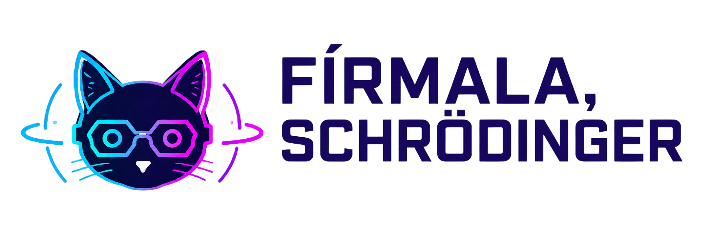
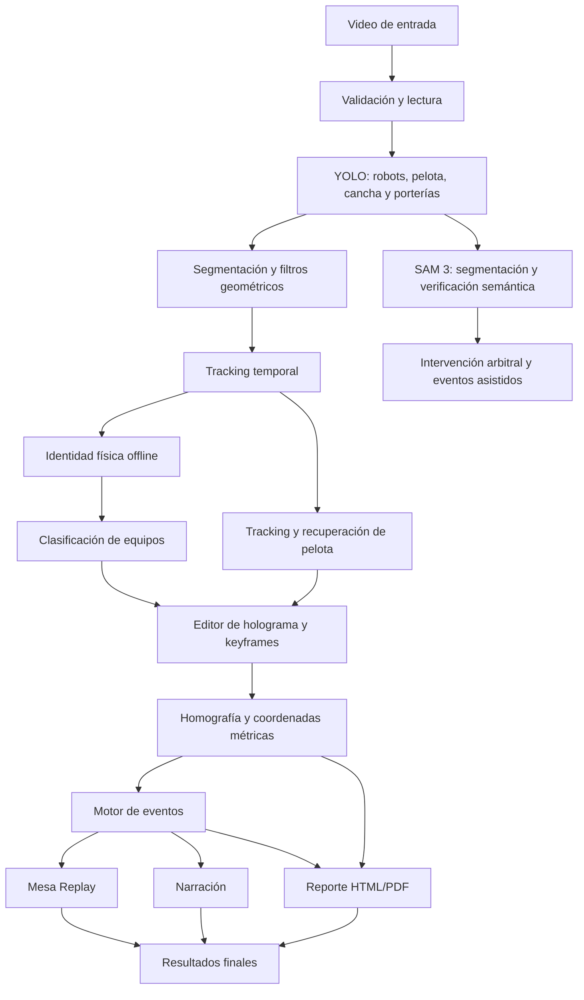

<p align="center">
  
</p>

<h1 align="center">Fírmala, Schrödinger — FutBotMX Vision Analytics</h1>

<p align="center">
  Sistema de visión por computadora para detectar, segmentar, rastrear y analizar partidos de fútbol robótico.
</p>

<p align="center">
  <strong>Versión 11.5.2</strong> · Equipo: <strong>Lore, Yamis y Oscar</strong>
</p>

<p align="center">
  
  
  
  
  
  
</p>

---

## Enlaces del proyecto

> Reemplazar los enlaces marcados antes de publicar la entrega final.

- **Video de demostración, máximo 2 minutos:** [Ver demostración](REEMPLAZAR_CON_ENLACE_DEMO)
- **Reel público de Instagram:** [Ver Reel](REEMPLAZAR_CON_ENLACE_REEL)
- **Reporte PDF de ejemplo:** [`docs/reporte_final.pdf`](docs/reporte_final.pdf)
- **Video procesado de ejemplo:** [`docs/video_procesado.mp4`](docs/video_procesado.mp4)

---

## Descripción

**Fírmala, Schrödinger — FutBotMX Vision Analytics** es un pipeline híbrido de visión por computadora diseñado para convertir un video de fútbol robótico en información deportiva interpretable.

El sistema combina detección con YOLO, segmentación y verificación semántica con SAM 3, tracking temporal, reconstrucción offline de identidades, clasificación de equipos, calibración mediante holograma, proyección a coordenadas métricas, detección de eventos, repetición esquemática, narración automática y generación de reportes HTML/PDF.

El objetivo no es solamente dibujar cajas sobre el video. El pipeline intenta reconstruir el estado físico del partido y conservar la incertidumbre cuando la evidencia visual no es suficiente. Por esta razón, una detección, una recuperación visual, una predicción y una interpolación no se tratan como si fueran mediciones equivalentes.

---

## Características principales

- Detección de robots, pelota, cancha y porterías.
- Segmentación de la superficie de juego.
- Integración de SAM 3 con adaptadores LoHa o DoRa.
- Tracking temporal de hasta cuatro robots y una pelota.
- Protección ante cruces, oclusiones e intercambios de identidad.
- Reconstrucción offline de identidades físicas.
- Clasificación de robots por equipo.
- Recuperación local de la pelota mediante color naranja adaptativo.
- Compensación de movimiento de cámara.
- Calibración métrica mediante holograma y keyframes.
- Proyección sobre una cancha física de **243 × 182 cm**.
- Detección automática de eventos del partido.
- Mesa Replay con trayectorias suavizadas.
- Narración automática con uno o dos locutores.
- Reporte estadístico HTML/PDF multipágina.
- Archivos JSON y JSONL para reproducibilidad y depuración.
- Perfiles de rendimiento para GPU, CPU y Apple Silicon.
- Reconstrucción del postprocesamiento sin repetir YOLO.

---

## Arquitectura del pipeline



### Flujo general

1. Se carga y valida el video.
2. YOLO detecta los objetos principales del partido.
3. Se aplican umbrales por clase y filtros geométricos.
4. El tracker mantiene continuidad temporal de robots y pelota.
5. Se reconstruyen identidades físicas usando el video completo.
6. Los robots se asignan a equipo magenta, azul o desconocido.
7. SAM 3 realiza segmentación o verificación semántica en los modos habilitados.
8. El usuario alinea el holograma de la cancha y guarda keyframes.
9. Las posiciones válidas se proyectan a coordenadas físicas.
10. El motor de eventos interpreta el estado del partido.
11. Se generan replay, narración, visualizaciones y reporte.

---

## Uso de SAM 3

SAM 3 se integra como una etapa complementaria de segmentación y validación semántica. El pipeline permite ejecutarlo con adaptadores PEFT:

- `LoHa`
- `DoRa`
- `none`, para omitir esta etapa en pruebas ligeras

En la configuración actual, SAM 3 se utiliza especialmente para revisar evidencia visual relacionada con intervenciones del árbitro y apoyar eventos como el retiro de un robot o una posible tarjeta roja.

YOLO funciona como detector principal debido a su velocidad y estabilidad cuadro por cuadro. SAM 3 se utiliza de forma selectiva en las ventanas donde su contexto semántico aporta información adicional.

---

## Detección con YOLO

El detector permite:

- seleccionar pesos nuevos, legacy o personalizados;
- configurar umbrales independientes por clase;
- ajustar el tamaño de inferencia mediante `--yolo-imgsz`;
- filtrar detecciones incompatibles con la superficie de juego;
- registrar detecciones rechazadas y su causa;
- detectar cancha mediante un modelo de segmentación cuando está disponible.

Los objetos principales son:

- robots;
- pelota;
- cancha;
- porterías;
- elementos auxiliares requeridos por eventos específicos.

---

## Tracking de robots

El tracker mantiene hasta cuatro robots y combina:

- movimiento predicho;
- distancia espacial;
- intersección sobre unión, IoU;
- tamaño de la detección;
- apariencia reciente;
- apariencia de referencia;
- soporte sobre la cancha;
- confianza del detector.

### Protección ante cruces y oclusiones

Para reducir intercambios de identidad:

- aumenta el peso de apariencia en tracks confirmados;
- rechaza asociaciones visualmente incompatibles;
- penaliza inversiones bruscas de trayectoria;
- marca asociaciones ambiguas;
- congela descriptores durante oclusiones;
- mantiene protección temporal después de una separación;
- revisa offline los intervalos ambiguos.

Cuando la evidencia no es suficiente, el sistema puede conservar una identidad como desconocida en lugar de forzar una asignación incorrecta.

---

## Tracking de la pelota

El seguimiento de la pelota combina:

- detección YOLO;
- modelo adaptativo de color naranja;
- búsqueda local cuando YOLO falla;
- predicción temporal;
- recuperación visual;
- interpolación de huecos cortos;
- suavizado offline.

El sistema distingue entre:

- medición real;
- recuperación visual;
- predicción;
- interpolación.

Esta diferencia se conserva en los archivos de salida para evitar presentar una estimación como si fuera una observación directa.

---

## Calibración de cancha y holograma

La calibración transforma coordenadas de imagen a coordenadas métricas sobre una cancha de **243 × 182 cm**.

El editor permite:

- arrastrar las cuatro esquinas de la plantilla;
- desplazar el holograma completo;
- cambiar zoom y opacidad;
- difuminar el fondo;
- invertir ejes;
- navegar entre keyframes;
- guardar, corregir o eliminar anclas;
- añadir nuevas correcciones cuando cambia la cámara.

### Estados de la geometría

- `ANCHORED`: existe un keyframe manual.
- `TRACKING`: seguimiento geométrico confiable.
- `COASTING`: oclusión temporal; la pose es provisional.
- `LOST`: evidencia insuficiente; se bloquean coordenadas oficiales.

Una pose provisional no genera coordenadas métricas oficiales. Esto evita publicar posiciones convincentes pero incorrectas.

---

## Eventos detectados

El motor de eventos puede registrar:

- cambio de posesión;
- balón fuera;
- balón oculto o perdido;
- balón recuperado;
- robot inactivo;
- robot reactivado;
- posible colisión;
- entrada al área penal;
- gol;
- tarjeta roja por robot retirado;
- fin del partido.

Cada evento puede incluir:

- timestamp;
- participantes;
- equipo;
- confianza;
- fuente de coordenadas;
- método de decisión;
- marcador acumulado.

> Los pases y tiros no se reportan como eventos oficiales mientras no exista evidencia suficientemente confiable.

---

## Visualizaciones y narrativa de datos

El sistema genera:

- video con detecciones y tracking;
- trayectorias de robots y pelota;
- mapa de movimiento;
- mapas de calor por equipo;
- control territorial;
- gráfica temporal de posesión;
- Mesa Replay;
- narración automática;
- reporte infográfico HTML/PDF;
- cronología completa de eventos.

### Reporte estadístico

El reporte incluye:

#### Estadísticas generales

- posesión confirmada;
- tiempo con balón;
- goles;
- entradas al área;
- distancia total;
- velocidad media;
- control de zonas;
- alertas de inactividad;
- colisiones;
- tarjetas rojas.

#### Métricas por robot

- distancia;
- velocidad promedio;
- velocidad pico robusta;
- tiempo con balón;
- entradas al área;
- número de eventos;
- actividad;
- calidad del tracking;
- estado operativo.

Cuando faltan datos confiables, el reporte utiliza `N/D` o muestra una observación explícita.

Los eventos comienzan en una página independiente y continúan automáticamente en tantas páginas como sean necesarias.

---

## Estructura del proyecto

```text
.
├── config/
│   └── equipos.json
├── inputs/
├── outputs/
├── tools/
│   └── rebuild_postprocessing.py
├── tests/
├── requirements.txt
├── LICENSE
└── src/
    ├── A_pipeline/
    ├── C_quick_view/
    │   ├── yolo_detector.py
    │   ├── temporal_tracker.py
    │   ├── preview_generator.py
    │   └── team_classifier.py
    ├── D_domain/
    │   ├── robot.py
    │   ├── ball.py
    │   └── game_state.py
    ├── E_events/
    │   ├── event_detector.py
    │   └── unity_exporter.py
    ├── F_simulation/
    │   ├── field_registration.py
    │   ├── mesa_replay_model.py
    │   └── mesa_replay_exporter.py
    ├── G_narration/
    ├── H_report/
    │   ├── assets/
    │   ├── templates/
    │   ├── charts.py
    │   ├── report_data.py
    │   └── run.py
    ├── shared/
    └── main_supr.py
```

La estructura exacta puede variar ligeramente entre versiones, pero `src.main_supr` es el punto de entrada principal.

---

## Requisitos

### Software

- Python 3.11 o 3.12
- FFmpeg
- Git
- Chromium de Playwright
- Controladores CUDA compatibles, opcionales
- Entorno virtual recomendado

### Dependencias principales

- NumPy
- SciPy
- OpenCV
- Pillow
- Matplotlib
- tqdm
- Ultralytics
- PyTorch
- torchvision
- Transformers
- PEFT
- Accelerate
- Hugging Face Hub
- Safetensors
- Jinja2
- Playwright
- WeasyPrint
- pydub
- Edge TTS
- pyttsx3
- gTTS
- pytest

### Hardware

- GPU NVIDIA con CUDA recomendada para el perfil `quality`.
- Apple Silicon puede utilizar MPS.
- CPU disponible mediante el perfil `cpu`, con mayor tiempo de procesamiento.
- SAM 3 con LoHa o DoRa es la etapa más costosa en CPU.

---

## Instalación

### 1. Clonar el repositorio

```bash
git clone REEMPLAZAR_CON_URL_DEL_REPOSITORIO
cd REEMPLAZAR_CON_NOMBRE_DEL_REPOSITORIO
```

### 2. Crear un entorno virtual

#### Windows

```powershell
py -3.11 -m venv .venv
.venv\Scripts\activate
```

#### Linux o macOS

```bash
python3.11 -m venv .venv
source .venv/bin/activate
```

### 3. Actualizar herramientas de instalación

```bash
python -m pip install --upgrade pip setuptools wheel
```

### 4. Instalar PyTorch

Instale PyTorch de acuerdo con su sistema, GPU y versión de CUDA.

```bash
python -m pip install torch torchvision
```

### 5. Instalar dependencias

```bash
python -m pip install -r requirements.txt
```

### 6. Instalar Chromium para el PDF

```bash
python -m playwright install chromium
```

### 7. Instalar FFmpeg

#### Windows

Instale FFmpeg y asegúrese de que `ffmpeg` esté disponible en `PATH`.

#### macOS

```bash
brew install ffmpeg
```

#### Ubuntu/Debian

```bash
sudo apt update
sudo apt install ffmpeg
```

### 8. Comprobar la instalación

```bash
python -c "import torch, cv2, ultralytics; print('PyTorch:', torch.__version__); print('OpenCV:', cv2.__version__)"
python -c "from transformers import Sam3Model, Sam3Processor; print('SAM 3 disponible')"
ffmpeg -version
```

---

## Ejecución

### Procesamiento completo recomendado

```bash
python -m src.main_supr "ruta/al/video.mov" \
  --sam-mode LoHa \
  --field-calibration hologram \
  --performance-profile quality \
  --narration \
  --pdf
```

### Variante con DoRa

```bash
python -m src.main_supr "ruta/al/video.mov" \
  --sam-mode DoRa \
  --field-calibration hologram \
  --performance-profile quality \
  --narration \
  --pdf
```

### Prueba ligera sin SAM 3

```bash
python -m src.main_supr "ruta/al/video.mov" \
  --sam-mode none \
  --performance-profile cpu \
  --yolo-imgsz 416 \
  --field-calibration hologram \
  --no-field-debug \
  --no-tracking-debug \
  --replay-frame-stride 3 \
  --pdf
```

### Ejecución ligera en macOS

```bash
export PYTORCH_ENABLE_MPS_FALLBACK=1

python -m src.main_supr "ruta/al/video.mov" \
  --sam-mode none \
  --performance-profile cpu \
  --yolo-imgsz 416 \
  --field-calibration hologram \
  --no-field-debug \
  --no-tracking-debug \
  --replay-frame-stride 3 \
  --pdf \
  --narration \
  --narration-mode duo \
  --narration-engine edge \
  --narration-script-engine template \
  --narration-max-events 6
```

---

## Perfiles de rendimiento

| Perfil | Resolución de segmentación | Frecuencia aproximada | Uso recomendado |
|---|---:|---:|---|
| `cpu` | 448 px | cada 6 frames | CPU, Mac y pruebas ligeras |
| `balanced` | 512 px | cada 3 frames | equilibrio entre precisión y velocidad |
| `quality` | 640 px | cada frame | GPU y máxima calidad |
| `auto` | automática | automática | selección según hardware |

Las opciones `--no-field-debug` y `--no-tracking-debug` reducen escritura y renderizado sin desactivar el análisis principal.

---

## Uso del editor de holograma

1. Abra el editor cuando aparezca durante el pipeline.
2. Ajuste las cuatro esquinas de la plantilla a las líneas reales.
3. Use el botón derecho para desplazar el holograma completo.
4. Ajuste opacidad, zoom o difuminado para mejorar la alineación.
5. Guarde el primer keyframe.
6. Añada una corrección antes y después de una oclusión grande.
7. Añada keyframes adicionales si cambia la perspectiva.
8. Seleccione **Terminar y procesar**.

Una buena calibración es indispensable para obtener distancias y velocidades físicas confiables.

---

## Regenerar únicamente el postprocesamiento

No es necesario volver a ejecutar YOLO, SAM 3 ni el editor de holograma para reconstruir eventos, replay, narración o reporte.

```bash
python tools/rebuild_postprocessing.py "outputs/partido" \
  --video "inputs/partido.mov" \
  --pdf \
  --narration
```

Solamente PDF:

```bash
python tools/rebuild_postprocessing.py "outputs/partido" \
  --video "inputs/partido.mov" \
  --pdf
```

El script reutiliza los archivos de detección y tracking ya existentes.

---

## Salidas principales

Cada ejecución crea una carpeta dentro de `outputs/`.

```text
outputs/nombre_del_partido/
├── quick_preview.mp4
├── quick_detections.jsonl
├── rejected_detections.jsonl
├── tracking_debug.jsonl
├── field_hologram_calibration.json
├── field_homography.jsonl
├── field_geometry_debug.mp4
├── field_rectified_debug.mp4
├── match_tracks.json
├── match_events.json
├── futbot_unity_mesa.json
├── mesa_replay_events.mp4
├── report/
│   ├── reporte_final.html
│   ├── reporte_final.pdf
│   └── report_data.json
└── narration/
    ├── narracion_completa.wav
    ├── narracion.srt
    ├── narration_manifest.json
    └── narration_schedule.json
```

Los videos de depuración pueden omitirse en equipos lentos.

---

## Configuración de equipos

El archivo `config/equipos.json` permite configurar la convención de equipos.

Ejemplo por apariencia:

```json
{
  "mode": "appearance",
  "apariencia_aliada": "oscuro"
}
```

Ejemplo mediante IDs:

```json
{
  "mode": "id",
  "apariencia_aliada": "claro",
  "equipos_por_id": {
    "0": "aliado",
    "1": "aliado",
    "2": "rival",
    "3": "rival"
  }
}
```

La convención debe verificarse para cada montaje de cámara y partido.

---

## Narración

El módulo `src/G_narration` puede producir:

- narración con uno o dos locutores;
- audio WAV;
- subtítulos SRT;
- manifiesto de eventos narrados;
- cronograma editorial;
- video de muestra narrado, cuando se solicita.

Motores disponibles según el sistema:

- Edge TTS;
- gTTS;
- Windows SAPI;
- pyttsx3;
- eSpeak;
- modo silencioso.

Ejemplo:

```bash
python -m src.main_supr "ruta/al/video.mov" \
  --field-calibration hologram \
  --narration \
  --narration-mode duo \
  --narration-engine edge \
  --narration-voice "es-MX-JorgeNeural" \
  --pdf
```

Edge TTS requiere conexión a internet.

---

## Resultados de ejemplo

### Tracking y segmentación

```md

```

### Holograma y reconstrucción métrica

```md

```

### Mesa Replay

```md

```

### Reporte estadístico

```md

```

> Cree la carpeta `docs/images/` y sustituya estos ejemplos por capturas o GIFs reales antes de la entrega.

---

## Validación

El proyecto incluye pruebas automatizadas para:

- geometría métrica;
- serialización de keyframes;
- tracking planar;
- cierre de deriva entre anclas;
- estados `TRACKING`, `COASTING` y `LOST`;
- oclusiones;
- límites físicos;
- compatibilidad con versiones anteriores;
- generación de eventos;
- exportación de resultados.

Ejecutar:

```bash
pytest
```

En una validación temporal sobre un fragmento real de 180 cuadros, el sistema mantuvo continuidad usando los estados de tracking y degradó a `COASTING` cuando disminuyó la evidencia, en lugar de aceptar una homografía nueva y desplazar arbitrariamente el holograma.

---

## Decisiones de diseño

### 1. Separar detección de observación confiable

Una caja YOLO no se considera automáticamente una posición física válida.

### 2. Separar identidad online de identidad física

Los IDs temporales pueden corregirse después de analizar el video completo.

### 3. Mantener incertidumbre

Cuando no existe suficiente evidencia, el sistema puede devolver `N/D`, equipo desconocido o coordenadas inválidas.

### 4. No confundir interpolación con medición

Los puntos reconstruidos para visualización se distinguen de las observaciones reales.

### 5. Calibración asistida en lugar de homografías falsas

El holograma manual con seguimiento temporal resultó más estable que aceptar automáticamente una geometría visualmente plausible pero incorrecta.

---

## Limitaciones conocidas

- La precisión métrica depende de la calidad de la alineación del holograma.
- Una oclusión total prolongada puede requerir un keyframe posterior.
- Robots casi idénticos pueden permanecer temporalmente como desconocidos.
- SAM 3 con LoHa o DoRa es costoso en CPU.
- La detección de tarjeta roja requiere evidencia visual real del árbitro.
- La etiqueta aliado/rival depende de una convención verificable.
- La atribución del equipo que anotó debe validarse según la orientación de la cancha.
- La interpolación mejora el replay, pero no sustituye una medición.
- Los pases y tiros todavía no se publican como eventos oficiales.
- Edge TTS requiere internet.
- El PDF requiere Chromium de Playwright o un renderizador compatible.

---

## Reproducibilidad

Para conservar una ejecución:

1. Guarde el comando utilizado.
2. No elimine los archivos JSON y JSONL.
3. Conserve `field_hologram_calibration.json`.
4. Registre los pesos y versiones de los modelos.
5. Registre la versión de Python y dependencias.
6. Incluya el video de entrada o un enlace autorizado.
7. No mezcle outputs de diferentes ejecuciones.

Comando útil:

```bash
python --version
python -m pip freeze > environment_freeze.txt
```

---

## Datos y privacidad

Los videos utilizados en la demostración provienen del material proporcionado para la Copa FutBotMX. Este repositorio no pretende identificar personas y centra el análisis en robots, pelota, cancha y eventos deportivos.

No se deben publicar:

- tokens;
- contraseñas;
- archivos `.env`;
- credenciales de Hugging Face;
- rutas privadas;
- datos personales no requeridos.

---

## Créditos

### Equipo

- **Lore** — desarrollo, integración y análisis.
- **Yamis** — desarrollo, validación y visualización.
- **Oscar** — arquitectura, visión por computadora, tracking y reportes.

> Ajustar las contribuciones individuales para reflejar exactamente el trabajo de cada integrante.

### Tecnologías y proyectos de terceros

Este proyecto utiliza o integra:

- **SAM 3**, Meta AI.
- **PyTorch**, PyTorch Foundation.
- **Transformers**, Hugging Face.
- **PEFT**, Hugging Face.
- **Ultralytics YOLO**, Ultralytics.
- **OpenCV**, Open Source Computer Vision Library.
- **NumPy** y **SciPy**.
- **Matplotlib**.
- **Jinja2**.
- **Playwright**.
- **FFmpeg**.
- **Edge TTS**, **gTTS** y **pyttsx3**.
- Videos de fútbol robótico proporcionados en el contexto de la **Copa FutBotMX** y la **Federación Mexicana de Robótica**.

Cada componente conserva su propia licencia y términos de uso.

---

## Licencia

El código desarrollado por el equipo se distribuye bajo la licencia **MIT**, salvo los componentes de terceros, modelos, pesos o datos que estén sujetos a licencias diferentes.

Consulte [`LICENSE`](LICENSE) y la documentación de cada dependencia antes de reutilizar o redistribuir el proyecto.

---

## Contacto

**Equipo Fírmala, Schrödinger**

- Repositorio: `REEMPLAZAR_CON_URL_DEL_REPOSITORIO`
- Correo de contacto: `REEMPLAZAR_CON_CORREO_DEL_EQUIPO`
- Reel: `REEMPLAZAR_CON_ENLACE_REEL`
- Demo: `REEMPLAZAR_CON_ENLACE_DEMO`

---

<p align="center">
  <strong>Fírmala, Schrödinger — Lore, Yamis y Oscar Vision Analytics v11.5.2</strong>
</p>
